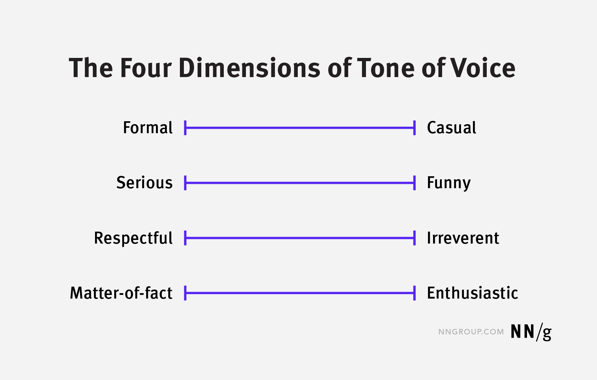

# Voice Principles

Good UX copy starts with knowing the difference between voice and tone, and then knowing how to apply each one.

## Understanding *voice* and *tone*

**Voice** is constant. It's Coveo's personality, staying consistent no matter where copy appears in the product.

**Tone**, also called *tone of voice*, is situational. It shifts to match the UI context and emotional state of the user in that moment.

Think of it this way: Whether you're explaining a complex idea or celebrating an achievement, you're still you. Your voice doesn't change, but you adapt your tone to fit the situation.

## What is Coveo's voice?

Coveo's voice can be described with three main qualities which should be present in every piece of copy.

### Clear

When something is complex, clear copy breaks it down. It should sound like a knowledgeable colleague explaining something, not a technical manual.

Clear copy:

- Uses plain words
- Keeps it short and respects the user's time
- Says exactly what to do or where to go
- Is easy to understand on the first read

### Human

The goal is a natural and intuitive user experience. Copy should be respectful, purposeful, and treat the user like a capable adult. This requires stepping out of an objective and technical mindset, and imagining the real person on the other side of the screen.

Human copy:

- Speaks directly to the user
- Uses natural language
- Gives guidance in frustrating UI contexts
- Prioritizes problem-solving
- Doesn't embellish with technical language

> **Note:** Conversational doesn't automatically mean "human." AI-generated copy can be human-like without considering the user's needs and emotional state. The text must also be [helpful](#helpful).

| Examples | Human | Non-human |
| -------- | ----- | --------- |
| **A user's source fails to rebuild** | Something went wrong. Check your source settings and try again. | An error was encountered during the source rebuild operation. |
| **A user leaves a required field empty** | Add a name to continue. | This field is required. |
| **A user's search returns no results** | No results. Try different keywords or clear your filters. | The query returned no matching results. Modify your search parameters and resubmit. |

### Helpful

Helpful copy means focusing on what the user needs to do and why it matters to them. It should answer a question before the user has to ask it, and guide the user forward without being overbearing.

Helpful copy:

- Guides without overwhelming
- Says what the user can do, not what the system did
- Gives next steps when something goes wrong
- Works in harmony with visual design elements

| Examples | Helpful | Not helpful |
| -------- | ------- | ----------- |
| **A source finishes rebuilding** | Your source is ready. Content is now searchable. | Operation completed successfully. |
| **A user's action is blocked by missing permissions** | You don't have permission to do this. Contact your administrator to request access. | Access denied. |
| **A user enables a feature for the first time** | Query suggestions are on. They will start appearing as users type in your search box. | Feature enabled. |

**Examples of *voice* shifting across brands:**

| Example scenario | Coveo voice | Non-Coveo voice |
| ---------------- | ----------- | --------------- |
| **A user is deleting a query pipeline association** | You're about to delete "association-123". This action can't be undone. | Say goodbye to "association-123"? It'll be gone for good! |
| **A user checks their watchtower for errors** | Nothing to report. If something comes up, it'll appear here. | *Crickets...* No news is good news. If something breaks, we'll post it right here. |

## Choosing the right tone

Tone in UX design can be visualized with four "dimensions." Where the copy lands on each scale depends on the current context—the user's goals, mood, and needs.

Some of these qualities remain consistent throughout Coveo's UX, while others can vary slightly. For example, Coveo's copy is neutral (middle) on the formal and casual scale and the serious and funny scale, regardless of the scenario.

- **Formal to Casual**: Neutral
- **Serious to Funny**: Serious-neutral
- **Respectful to Irreverent**: Neutral
- **Matter-of-fact to Enthusiastic**: Often matter-of-fact, verges on enthusiastic in certain scenarios

**Examples of Coveo's *tone* shifting across UI scenarios:**

| Serious | Enthusiastic | Matter-of-fact |
| ------ | ------------ | -------------------- |
| You're about to delete "pipeline-123". This action can't be undone. | Success! Your query pipeline "pipeline123" has been saved. | No query pipelines found. Try changing or clearing your filters. |

See the rules for [writing mechanics](writing-mechanics.md).
